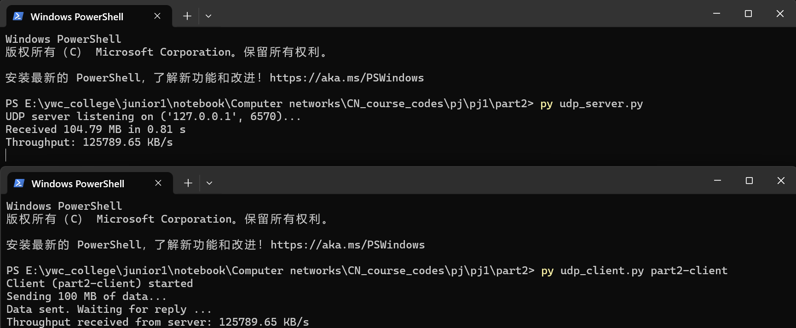

# Part 2 Readme

This part implements a simple UDP server and client to measure throughput.

The client sends a total of 100 MB of data to the server. Data is transmitted in multiple batches to better reflect real-world transfers.

The first batch is marked with "START" and the final batch with "END", so the server can calculate the total transmission time.

Run the examples:

```bash
py udp_server.py
```

```bash
py udp_client.py [client_name]
```

Example output:


