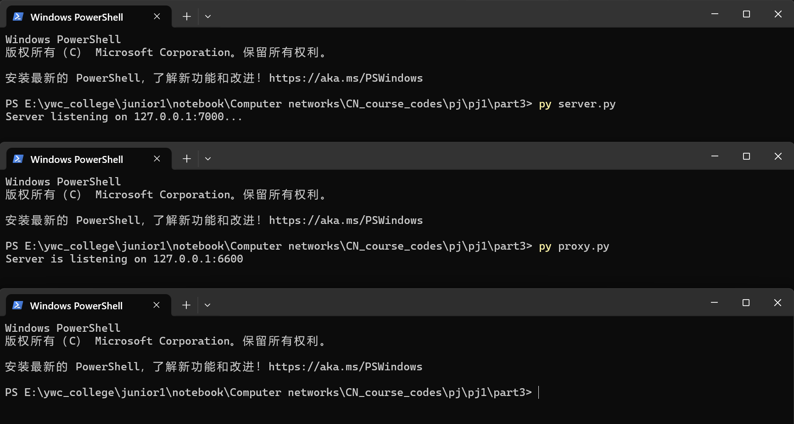
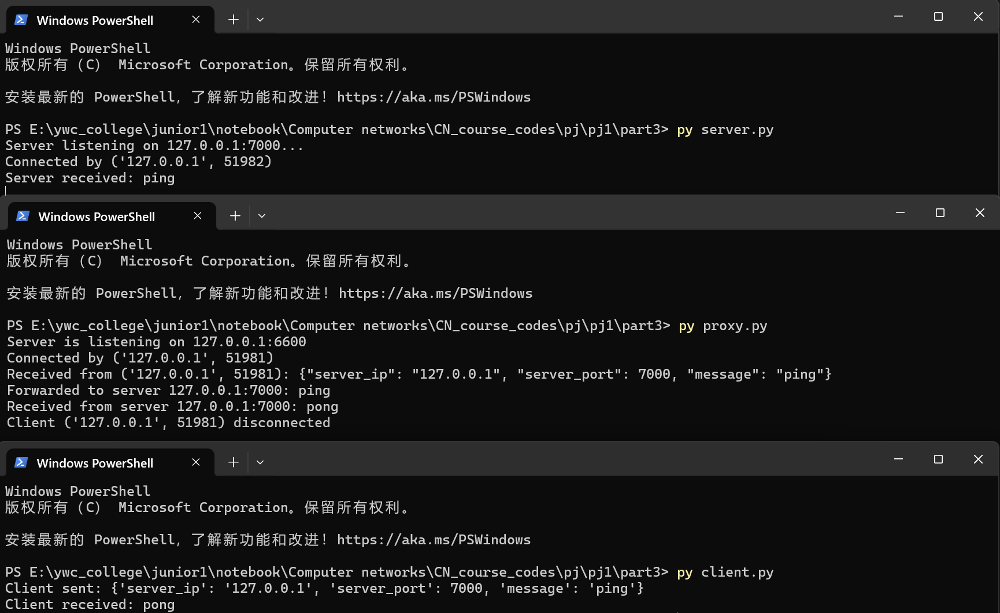

# Part3 Readme

In this part, we implement a TCP proxy server. This is an illutration of how it works.

1. Start the server and proxy server first by running:

   ```bash
   py server.py
   ```

   ```bash
   py proxy.py
   ```

   

2. Then, in another terminal, run the client to send messages via the proxy server:

   ```bash
    py client.py
    ```

    The proxy server uses the json module to parse the message received from the client, extracting the destination IP address and message content. It then checks whether the IP address is on the blocklist before forwarding the request.

    If the IP address is allowed, the message will be forwarded to the server and the response will be received back via the proxy server.

    Here is the output:

    

    If the IP address is blocked, the proxy server won't forward the request and will reply with an “Error” message instead.

    Here is the output:

    
