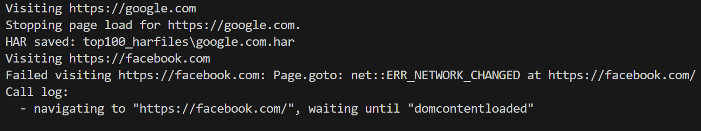

# Report for PJ2 Part 2

## 1. Web crawling

In this part we implemented a simple web crawler which collects 100 HAR files from different website.

### Files included

- `web_crawler_pw.py` -- main crawler script (Playwright)
- `spotify_test.py` -- single-site test script
- `har_analyzer.py` -- HAR analysis script
- `top100_harfiles/` -- collected HAR files
- `third_party_domains_top10.csv`, `third_party_cookies_top10.csv`, `third_party_cookies_full.csv`, `site_third_party_requests.csv` -- analysis outputs


### Packages imported

- `playwright` for web crawling

### Related files

- web_crawler_pw.py    -- main crawler script
- top100_harfiles/  -- folder to store collected HAR files
- top-1m.csv  -- list of top 1 million websites

### Runtime Screenshot



### Problems encountered and solutions

- Some websites take too long to load or have continuous background requests. For example, sotify.com is a SPA website. We set a timeout for page loading and wait for a short time of network idle state before stopping the page load.

- Some websites cannot be crawled due to external issues:
  - **Connection Refused**: Server-side issues or network restrictions.
  - **Name Resolution Failure**: Invalid or non-existent domains.
  - **SSL Certificate Errors**: Misconfigured or invalid SSL certificates.

### Example Logs for Failed Crawls

```log
2025-11-14 21:38:56,710 - ERROR - Failed visiting https://amazonaws.com: Page.goto: net::ERR_CONNECTION_REFUSED at https://amazonaws.com/
Call log:
  - navigating to "https://amazonaws.com/", waiting until "domcontentloaded"

2025-11-14 21:39:16,236 - ERROR - Failed visiting https://akamaiedge.net: Page.goto: net::ERR_NAME_NOT_RESOLVED at https://akamaiedge.net/
Call log:
  - navigating to "https://akamaiedge.net/", waiting until "domcontentloaded"

2025-11-14 21:39:16,449 - ERROR - Failed visiting https://a-msedge.net: Page.goto: net::ERR_NAME_NOT_RESOLVED at https://a-msedge.net/
Call log:
  - navigating to "https://a-msedge.net/", waiting until "domcontentloaded"

2025-11-14 21:39:27,579 - ERROR - Failed visiting https://googlevideo.com: Page.goto: net::ERR_CERT_COMMON_NAME_INVALID at https://googlevideo.com/
Call log:
  - navigating to "https://googlevideo.com/", waiting until "domcontentloaded"
```

## 2. HAR analysis

What is concerned in this part:

- entries[].request.url
- entries[].request.cookies
- entries[].response.cookies

### Packages imported

- `tldextract` for extracting domain information from URLs
- `json` for handling HAR file data
- `csv` for writing analysis results to CSV files

### Programs / Packages used

- Python 3.x
- `playwright` (for crawling and HAR collection)
- `tldextract` (for extracting SLDs)

Install:

```bash
pip install playwright tldextract
playwright install
```

### Related files

- `har_analyzer.py`    -- main analysis script
- `top100_harfiles/`  -- folder containing collected HAR files
- `har_analysis_summary.csv`  -- summary of analysis results

### Analysis Results

The statistics results may change depending on time provided for background network requests during crawling. The program set a timeout of 3 seconds and collected the following results:

`third_party_domains_top10.csv`

| item              | count |
| ----------------- | ----- |
| microsoft.com     | 431   |
| gstatic.com       | 312   |
| pinimg.com        | 218   |
| tiktokcdn-us.com  | 185   |
| dropboxstatic.com | 174   |
| google.com        | 153   |
| rbxcdn.com        | 145   |
| githubassets.com  | 135   |
| vimeocdn.com      | 98    |
| yimg.com          | 95    |

`third_party_cookies_top10.csv`

| item                       | count | purpose | source |
| -------------------------- | -----:| --------------- | ------ |
| receive-cookie-deprecation | 10    | Targeting / advertising; appears related to Google ad tech (used to track/measure cookie deprecation behavior). | Cookiepedia / observed |
| rlas3                      | 9     | Advertising/tracking cookie (rlcdn/advertising networks). | Cookiepedia / cookie DBs |
| pxrc                       | 9     | LiveRamp cookie-sync related — used for identity syncs between advertising systems. | Cookiepedia / LiveRamp info |
| li_sugr                    | 9     | LinkedIn identity/tracking cookie used for probabilistic matching and embedded services. | Cookiepedia / LinkedIn docs |
| audit                      | 8     | Unknown (no authoritative public docs). Frequently observed as a third‑party cookie; likely used by audit/consent/analytics tools. | Cookiepedia (unknown) |
| uuid2                      | 8     | Ad exchange identifier (AppNexus/Xandr) used for targeting/identifier mapping. | Cookiepedia / Xandr references |
| XANDR_PANID                | 8     | Xandr/AppNexus user-id mapping cookie — used to distinguish browsers/devices and enable ID sync for ad serving. | Xandr docs / cookielibrary |
| personalization_id         | 8     | Twitter/X tracking cookie used for personalization and targeting. | Cookiepedia / Twitter docs |
| audit_p                    | 8     | Unknown (no direct matches). Likely a variant of `audit` or a cookie set by consent/audit tooling. | Observed; no Cookiepedia entry |
| khaos                      | 8     | Targeting/advertising cookie (Rubicon/Magnite internal user identifier). | Cookiepedia / cookie databases |

**Notes & sources:**

- Many descriptions come from Cookiepedia (https://cookiepedia.co.uk/) and related cookie databases (cookie.is, cookiesearch.org, cookielibrary.org). For cookies without a documented purpose on Cookiepedia (e.g., `audit`, `audit_p`) we mark them as "Unknown" and report observed usage patterns (third‑party prevalence, typical host domains).
- `XANDR_PANID` has corroborating references in Xandr documentation and industry cookie lists describing it as a user-id / sync cookie used by the Xandr/AppNexus ad platform.

## 3. Method summary

- HAR collection: Playwright `browser.new_context(record_har_path=..., record_har_content="omit")` to avoid embedding large responses.
- Timeouts used: `LOAD_TIMEOUT=10000 ms`, background wait `BACKGROUND_TIMEOUT=1000 ms` (adjustable in `web_crawler_pw.py`).
- Third‑party domain counting: use SLD (via `tldextract`); count requests to domains whose SLD differs from the visited site's SLD (counts are total requests across all sites).
- Third‑party cookie counting: for each site collect unique third‑party cookie names seen (presence per site), then aggregate across sites to get top‑10.
- Output files: `third_party_domains_top10.csv` (top domains by request count), `third_party_cookies_top10.csv` (top cookies by number of sites where they appeared), `third_party_cookies_full.csv` (full cookie counts), `site_third_party_requests.csv` (per-site domain request counts).
